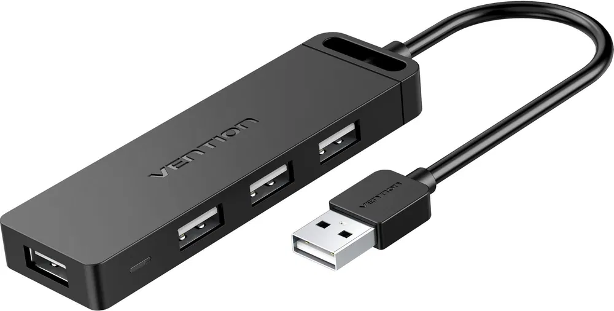
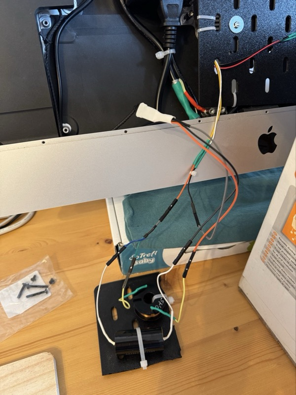
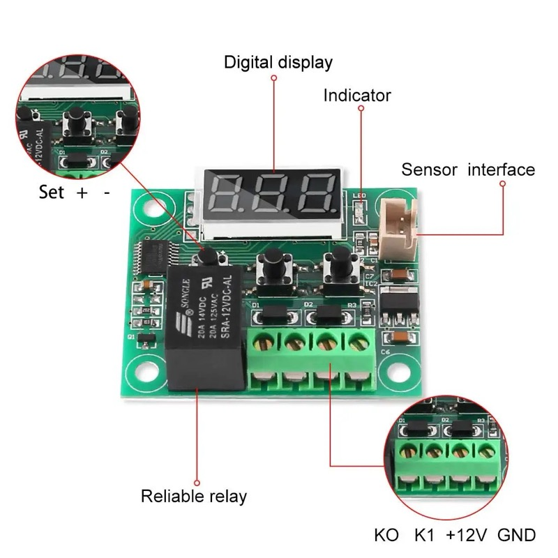
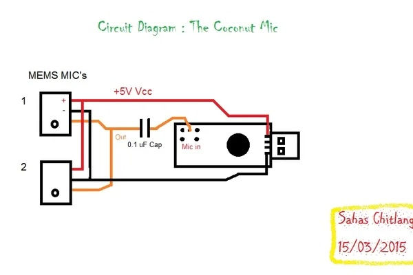

# 27" iMac 2017 to 5K Display Conversion

Here are my notes from the conversion process of 27" iMac 2017 which utilize P3 display to standalone 5K resolution display 5120 x 2880 @ 60Hz / 10bit. It is working like stock 5K displej where everything is working out of the box with just plug of the single USB-C cable.

## Result with speakers, camera and external microphone

Under display is
- Temperature of R1811 CPU and (case) probe behind power supply (currently showing fan RPM)
- Homemade microphone

- I wanted to use one cable (USB-C) for everything (camera, speakers, microphone, charging) except ethernet, because I already have a faster wireless connection and ethernet on USB 2.0 could be 100Mbps maximum. You can still connect USB ethernet card to one of the USB 2.0 ports that are outside of the case if you wish.
- Files for 3D printed parts are on Printables (see below) or in `stl` folder.
- Control volume and brightness is working using standard keys on Apple Keyboard with BetterDisplay installed.
- Settings of display and software is at the end.

## What is inside the iMac case

- Camera 3840 x 2160 12MP
- Original speakers with custom Crossovers (audio polypropylene capacitor and air-cored inductor)
- Driver Board R1811 V4 (brain of the display)
- Stock Power Adapter reusing iMac power connector
- Current Board DZ-LP0818 (brightness board)
- Noctua fan in position of Apple logo in the back
- USB 2.0 hub (4 ports) for camera and 3x USB 2.0 ports outside of the case
- Microphone is finally **outside of the case** for better sound quality. Not working well for FaceTime because Apple does not support echo canceling. All others video conferencing apps are fine.
  - I tried microphones inside the case, but my voice was somehow distorted during video calls, probably because of strong echo in the case.

## Sources

- [Most precious Mac Rumors thread - DIY 5k Monitor - success :-)](https://forums.macrumors.com/threads/diy-5k-monitor-success.2253100/)
  - I read all the posts from the beginning before I started the conversion. I took me 2 weeks to read them all. This documentation is for those, who want to convert their 27" iMac to 5K display using R1811 and don't want to waste time reading the whole thread which have 115 pages currently :)
  - There is a lot of useful information in the thread though and helpful people like PaulD-UK so if you have a time, I recommend you to read the whole thread.
- [Mykola's blog](https://khronokernel.com/macos/2022/03/01/5K-MONITOR.html)
- [aiwipro](https://github.com/aiwipro/5K-iMac-Studio-Display-Stock-Look)

## What you need

- Patience
- Prudence
- Dremel or similar tool
- Basic soldering skills with soldering stuff
- Wires for connecting speakers and crossovers with driver board and also modifying the stock fan for quietter operation

## What to buy

### Basics

| Item | URL |
| --- | --- |
| DIY 5K Universal R1811 V.4 Driver Board USB-C Freesync EDP DP1.4 Compatible for iMac LM270QQ1 LM270QQ2 Screen External Monitor - **model LM270QQ1**  | https://www.aliexpress.com/item/1005002734914614.html |
| High-quality DIY Universal Driver Board 50W Current Board DZ-LP0818 Resolve the Panel brightness problem LM270QQ1 LM270QQ2 - **model LM270QQ1**  | https://www.aliexpress.com/item/1005001660237411.html |
| 4K 3840 x 2160 12MP HD IMX258 USB Camera Module AF/FF 75/80/120/135 Degree 30FPS for Face Recognition - **model 75deg AF**  | https://www.aliexpress.com/item/1005007360663282.html |
| Noctua NF-A4x10 40mm Computer Case Fan 5V/12V PWM SSO Magnetically Stabilized Bearing Quiet Cooling Fan - **model 12V 4PIN PWM, Other, NO RGB**  | https://www.aliexpress.com/item/1005005402810322.html or local store |
| W1209 DC 12V Heat Cool Digital Thermostat Temperature Controller Miniature Thermostat Temperature Control Switch Panel - **model red**  | https://www.aliexpress.com/item/1005007254239187.html or local store |
| W1209 DC12V cool temp thermostat temperature control switch temperature controller Acrylic case transparentBox - **model Black**  | https://www.aliexpress.com/item/1005002657916334.html |
| Single 12V 0.8A DC PWM 2-3 Wire Fan Temperature Control Speed Controller Chassis Computer Noise Reduction Module NTC B 50K 3950 - **model PWM 4Wire**  | https://www.aliexpress.com/item/1005007103040202.html |
| Small 2.0 USB Hub with 4 ports. I used Vention 4-Port USB 2.0 Hub with Power Supply 0.15m Black  | https://www.alza.cz/vention-4-port-usb-2-0-hub-with-power-supply-0-15m-black-d5859680.htm or local store |
| 90 Degree Right Angle USB 3.1 Type C Male To Female Converter USB-C Adapter for Samsung Huawei Smart Phone Portable Connector - **model NO.1**  | https://www.aliexpress.com/item/1005004418858018.html |
| LCD Display Screen Adhesive Strip Sticker Tape + Opening Tool Kit for Apple iMac 21.5" A1418 A2116 27" A1419 A2115 - model **model 27inch Adhesive Tool**  | https://www.aliexpress.com/item/1005004826457033.html |
| 1x JST XH (2.54mm) 2 pin, cable - female (stock FAN & Noctua FAN)  | https://www.gme.cz/v/1514940/jst-xh-2pin-kabel or local store |
| 1x JST PH (2mm) series 4 pin, cable - female (driver board speakers)  | http://www.hezkyden.cz/shop/konektory-ph20mm-prumyslova-propojka/ or local store |
| 1x JST PH (2mm) series 2 pin, cable - female (power for PWM control board for Noctua fan from driver board)  | http://www.hezkyden.cz/shop/konektory-ph20mm-prumyslova-propojka/ or local store |
| 7642.05.01.9/F cable eyelet M4 for power grounding  | https://www.gme.cz/v/1499739/764205019-f-kabelove-ocko-m4 or local store |
| 2W 180 Ohm rezistor to make stock fan quiet  | https://www.gme.cz/v/1488150/gym-cym-rmo-180r-2w-5-0411-metal-oxidovy-rezistor or local store |
| MOLEX 43640-0301 Micro-Fit 3.0 female 3mm, 1x3pin, for cable  | https://www.gme.cz/v/1502876/molex-43640-0301-micro-fit-30-vidlice-roztec-3mm-1x3piny-prima-na-kabel or local store |
| MOLEX 43031-0007 male for Molex Micro-Fit  | https://www.gme.cz/v/1502732/molex-43031-0007-krimpovaci-kontakt or local store |
| Tape 300 x 3,6 mm 100 pcs white  | https://www.alza.cz/EN/vorel-tape-300-x-3-6-mm-100-pcs-white-d8069517.htm or local store |
| M3 Screw Bolt Nuts Kit 3x12mm  | https://www.gme.cz/v/1511744/wurth-slkm3x10-ocelovy-sroub-m3x10mm-phillips-zapustna-hlava-pozinkovany and https://www.gme.cz/v/1511808/wurth-skm3k-matice-m3 or local store |
| M5TD USB C Extension Cable Type C Female to USB 2.0 Male Extender Converter Data Transfer Adapter for Phone Laptop  | https://www.aliexpress.com/item/1005007331665334.html?spm=a2g0o.order_list.order_list_main.141.5a1f1802kSHMX1 |
| OTG Cable Type C 10Gbps USB to Type C Adapter Connector for Laptop Phone Female USB to Male USB C Data Cable for Mouse Keyboard  | https://www.aliexpress.com/item/1005007399154302.html?spm=a2g0o.order_list.order_list_main.126.5a1f1802kSHMX1 |

### Microphone

| Item | URL |
| --- | --- |
| UGREEN Sound Card USB Audio Interface External 3.5mm Microphone Audio Adapter Soundcard for PC Laptop PS4 Headset USB Sound Card - **model 2Ports 15cm**  | https://www.aliexpress.com/item/1005006519284690.html |
| 2x ADMP401 ADMP404 MEMS Microphone Breakout Module Board For Arduino Universal 1.3cm*1cm 1.5 to 3.3VDC With Pins - **model ADMP404**  | https://www.aliexpress.com/item/1005005316748856.html |
| 0.1uF Capacitor for MEMS Microphones (1pcs) 直插铝电解电容0.1UF 0.22UF 0.33UF 0.47UF 50V 511MM ±20% Variant: 0.1UF 50V 511 50只 - **model 0.1µF**  | https://www.aliexpress.com/item/1005003133078519.html |

### Crossovers

| Item | URL |
| --- | --- |
| 2x 2Pcs SPIRIT Audio Capacitor MKP Audiophile Frequency-Divided Divider 400V 2.2uF 3.3uF 3.9uF 4.7uF 6.8uF 10uF For Speaker Audio - **model 400V 10uF**  | https://www.aliexpress.com/item/1005002925052109.html?spm=a2g0o.order_list.order_list_main.101.75ef1802rZrBOv |
| 0.07mH~3.3mH wire diameter 1.0mm American ERSE oxygen-free copper air-core inductor ALQ frequency divider is special - **model 1mm 0.15mH**  | https://www.aliexpress.com/item/1005008969078518.html?spm=a2g0o.order_list.order_list_main.10.75ef1802rZrBOv |

* If you don't want to use crossovers, you can connect the speakers to series.

## What to print on 3D printer

- Current Board
- Custom Crossovers
- Driver Board with both Pads
- PWM Control Module Box with back wall
- R1811 Control Strip with back wall
- Microphone Box - front
- Microphone Box - main
- USB Camera Mount
  - For camera, I used Camera Mount from here https://www.printables.com/model/311111-apple-imac-27-2014-5k-monitor-conversion

| Crossovers | Driver Board | Current Board |
| --- | --- | --- |
|  |  |  |

## Build

- For disassembly, see any video for example this one from [How-FixIT](https://www.youtube.com/watch?v=96MiQn645jI)
- **Beware!** Use designated opening tool only, otherwise you can cut the cable to display which is near the top. If you use any other cutter, **do not cut too deep!** If do so, you will probably break the ribbon cable and result could be like in this post on Mac Rumors forum [DIY 5k Monitor - success :-)](https://forums.macrumors.com/threads/diy-5k-monitor-success.2253100/post-32835650)
- If you have other model than iMac 2017, check display type before ordering driver board. When you dismount the display, type is in lower right part of the display. For iMac 2017, it is LM270QQ1
- If you don't want to use crossovers, connect the speakers directly to the driver board. Speakers can be connected to series in speaker connector like this 

### First cut :)

### Connecting and first testing

When all parts arrives, test driver board and current board. Pay attention to details. Cables must be positioned exactly as on pictures.

| Brightness cable connection to display | LVDS cable connection to display |
| --- | --- |
|  |  |

Connect cables to boards. Do not forget R1811 control strip which is on the bottom right corner of driver board on this picture.  
  

- When you connect power, OSD should appear on display. If not, turn on driver board by button next to remote diode on control strip. Then connect Mac using USB-C port and it should detect display and show desktop. Mine is detected as iMacPro5K.

### Speaker connectors

| Speaker connector with contacts facing you | Description of PINs |
| --- | --- |
|  | **Woofer +** **Woofer -** ID link (ignore) ID link (ignore) **Tweeter +** **Tweeter -** |

### Crossovers

**Capacitors** are connected to **Tweeter +** and **Driver Board +** for every channel  
**Air-cored inductor** are connected to **Woofer +** and **Driver Board +** for every channel  
**-** are connected together in speaker connector and connected to **Driver Board -** for every channel  

| Crossover testing | PaulD-UK schema from Mac Rumors forum |
| --- | --- |
|  |  |

### Driver Board speaker connection

| Driver Board Audio Connector | Description of channels |
| --- | --- |
|  | **Left +** **Left -** **Right -** **Right +** |

### Camera

Camera is connected by (included) USB cable to USB 2.0 hub. 3D printed part is a little bigger. I put the camera to lower right corner and I don't have issues with AF or image so I kept it like this.  

### Power

I wanted to reuse power connector of iMac 2017. If you don't want to, you can skip this section. Otherwise, beware live wire and focus on soldering here.

| Apple Power Connector with Live wire | Soldered Power Connector |
| --- | --- |
|  |  |

| Final connection to stock power adapter | Soldering of Live wire example |
| --- | --- |
|  |  |

### Fans

- **Noctua fan with PWM control module** is used as case fan. It sucks hot air from the case to outside and speed is controlled by temperature of probe behind power supply
- **Stock fan on R1811 CPU with W1209 and 180 Ω resistor** to make it more quiet. Resistor is bridged when specified temperature on CPU heatsink is reached

Power Supply is in iMac case so I need some fresh air in there but also keep the display quiet. So I modified Apple logo and placed Noctua fan there which (after small cutout on the left side) fits here perfectly.

- Use heatgun for a couple of seconds to get rid of the thin cover
- Cut like about 1mm of logo on the left side so fan fits perfectly inside the logo
- Mark 4 holes for mounting the fan
- Then I used thin and very sharp knife to mark circle around fan so I know where to cut the circle to logo

  
  
  
  
  

- Connect fan to extension cable included in Noctua box with fan and then to PWM control module.

- I placed probe of the module behind power supply (top part) so I can check highest temperature area of the display.

- Remove the arrows from JST PH 2 pin connector so it can be connected to driver board.

- Connect this connector (after soldering to PWM power cables) to driver board here
- **Ignore cable colors on pictures, connect +ve on driver board to +ve cable on PWM module** and the same with -ve
- Polarity is written on the back of the driver board but to be sure, **use multimeter to check polarity!**

| Power for PWM control module for Noctua fan | Polarity. Check with multimeter! |
| --- | --- |
|  | - - + + + |

- PWM control module. Connect Noctua fan extension cable on the right side and power to left upper side.

- Connection overview of PWM control module for Noctua fan and W1209 relay module for stock fan
  - On the right side, fully connected PWM control module with Noctua extended cable, power from driver board and (included) probe (hidden).
  - On the left side, simple relay W1209 module with 180 Ω resistor (hidden in insulation) on +ve wire of stock fan with probe attached to heatsink.

- Temperature probe of W1209 is placed on stock fan using this office clip. Red part is just insulation of holder.

- Connection schema of W1209 with resistor for stock fan.

- W1209 description

- I increased the size of the hole in the case of W1209

| Increased hole in the case | So wires can easily go behind the case |
| --- | --- |
|  |  |

### Final assembly

- Cables fixed on back of the display

- Driver Board R1811 on 3D printed holder

  

- Connectors reachable throught RAM door

  

- Insert USB to USB-C cables with USB connectors through UTP port holes on the back of the case
- Camera is connected to the top USB port of the hub (covered by right crossover on picture)
- Camera cable is pretty long and is hidden under current board
- Camera litte control board above of Noctua fan is fixed on place by hot-melt hand gun
- Power supply is fixed on HDD enclosure by Epoxy glue
- Driver Board holder is shifted on the top side from the back of the iMac case using pads. 9 mm is on the left side and 6 mm is on the right side. Put it under holder between the holder and aluminium column
- Nuts are prevented from falling out of the holder by using hot-melt glue

#### Version 1

#### Version 2

* Fan tunnel to better removal of hot air from power supply is used, but I added it also to v1.
* 3D printed parts were improved and uploaded to my profile on [Printables.com](https://www.printables.com/@jorycz_3422851).

### Back of the display

| RAM door | Whole back |
| --- | --- |
|  |  |

### Control Strip

I put small amount of glue from hot-glue gun on LED diode to make it more dim and then 3 second glue to attach it to iMac case.

| Control strip | Glued |
| --- | --- |
|  |  |

### Sound card modification and External Microphone

Remove the case of the Sound card. Connection is based on Sahas's Coco-Mic.

| Asembly of Sound card with Microphones | Detail with capacitor |
| --- | --- |
|  |  |

| Coco-Mic schema | Final Part |
| --- | --- |
|  |  |

For microphone, I just quickly designed box just for testing purposes and finally keep it. I used white plastic walls from Driver Board box as sound insulation to help with noise from speakers.

| Microphone | Microphone |
| --- | --- |
|  |  |
|  |  |

## Settings

### Toggle OSD Language to English

OSD Language is set to Chinese. You can find language menu as show on this picture. Chinese pictogram is 语言 (Language) and there is Chinese and English only.

### Color Profile

I have another original iMac 2017 next to this one and most similar colors I get when I keep everything untouched and set **Gamma to 2.0**.

### Better Display

To be able to control volume and brightness using standard keys on keyboard, you need to install BetterDisplay. Free version is OK.  
Let it detect DCC and then adjust settings like this.  

### W1209 - Driver Board Fan Control

- Press SET when it's running to show current temperature when relay switch to ON and eliminate the rezistor. I have set it to **39°C** so it will set CPU fan to 100% when 41°C is reached. Never happened so far even during hot summer
- Hold SET for SETUP other parameters if you wish
  - Full setup is [described here](https://forums.macrumors.com/threads/diy-5k-monitor-success.2253100/page-75?post=33483781#post-33483781) if you need it

### Noctua PWM Controller - Case Fan Control

- Press OK when it's running to show current PWM setup in %. I have set it to **5%**
- Hold OK for SETUP other parameters
  - L30 changed to **L45** (this is temperature at which fan will start)
  - H50 changed to **H60** (this is temperature at which fan will run at 100%)
  - C20 is temperature at which fan will stop
  - d 0 - PWM output direction (forward / rewerse) keep on 0

# Final note

That's it. It is working perfectly. When I connect MacBook Air M4 to the display using USB-C, display wakes up in couple of seconds and everything works like it was Apple designed (for half of the price of Apple Studio Display, iMac price included). 😎  
  

